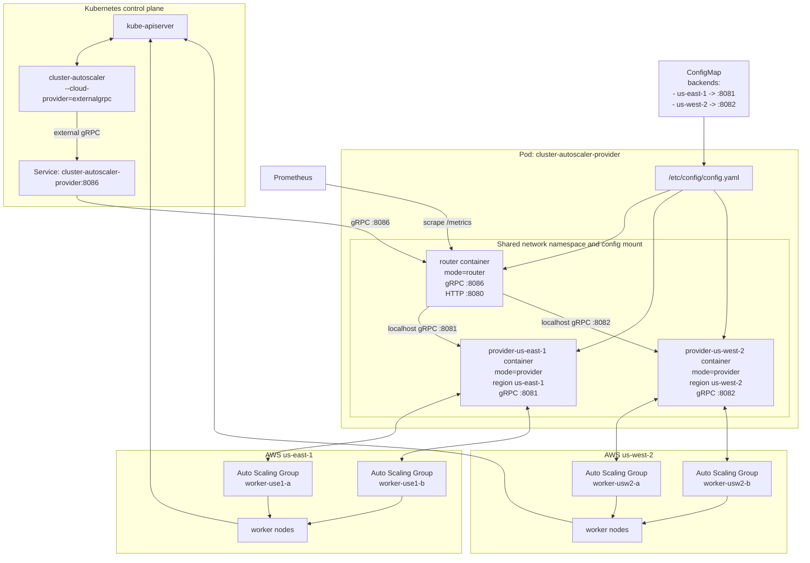

# Cluster Autoscaler Provider Gateway

## Problem

The upstream AWS Cluster Autoscaler provider assumes one AWS region per process.
This wrapper needs to serve a multi-region cluster through one external gRPC
endpoint, which means it cannot safely construct multiple upstream AWS
providers in one process.

That collides with upstream process-global metrics registration. The AWS provider
registers `cluster_autoscaler_aws_request_duration_seconds` through
`legacyregistry.MustRegister` when `BuildAWS` runs. A second `BuildAWS` call in
the same process tries to register the same collector again and panics with:

```text
duplicate metrics collector registration attempted
```

Making registration idempotent would prevent the panic, but it would still mix
all AWS request metrics in one process because the upstream metric labels are
`endpoint` and `status`; they do not include region.

## Proposal

Run one router process and one upstream AWS provider process per region in the
same Pod.

The Cluster Autoscaler still connects to exactly one external gRPC endpoint. The
router implements the upstream external gRPC `CloudProviderServer` API and fans
out or routes requests to the regional provider workers over localhost.

Each provider worker builds exactly one upstream AWS provider with one
`AWS_REGION`. The important isolation boundary is the process, not the region or
the Pod. Multiple providers can share a Pod safely as long as each region still
has its own process.

This keeps the deployment operationally simple:

- one Deployment
- one Service for Cluster Autoscaler
- one shared config file listing regional backends
- localhost-only traffic between the router and provider workers

## Deployment



## Router Behavior

The router owns multi-region composition. Regional provider workers remain thin
wrappers around the upstream AWS provider.

Required router behavior:

- `NodeGroups`: call every regional provider and return the union.
- Node group IDs: namespace returned node group IDs with the region, for example
  `us-east-1/asg-name`, so ASG name collisions are impossible.
- Node-group methods: route by the region prefix and strip the prefix before
  forwarding to the matching provider worker.
- Node-based methods: parse the AWS region from `node.Spec.ProviderID`, for
  example `aws:///us-east-1a/i-123`, then route to the matching provider
  worker.
- `Refresh`: fan out to all provider workers.
- `Cleanup`: fan out to all provider workers.
- Health checks: probe each worker and expose aggregate liveness, readiness, and
  worker-count metrics on the router HTTP port.

### Router Health

The router exposes three HTTP endpoints:

- `/healthz`: liveness only. If the router process is serving HTTP, it returns
  `200 OK` with the current configured, healthy, and unhealthy worker counts.
- `/ready`: readiness for Cluster Autoscaler traffic. It returns `200 OK` only
  when at least one provider worker is currently healthy. If all workers are
  unhealthy, it returns `503 Service Unavailable`.
- `/metrics`: router metrics, including configured, healthy, and unhealthy
  worker gauges.

Worker health is not inferred once at startup and left alone. The router:

- performs an initial worker probe when it starts
- re-probes every configured worker every 5 seconds
- uses `NodeGroups` as the probe RPC
- treats probe timeouts or RPC failures as worker failures

The current probe timeout is 2 seconds per worker.

### Worker Failure Handling

The router tracks health per configured region. A worker is marked unhealthy
when:

- the periodic `NodeGroups` probe fails
- a routed node-group or node-based RPC to that worker fails
- `Refresh` or `Cleanup` fanout to that worker fails

When a worker call succeeds again, the router marks that worker healthy again.

Failure handling is deliberately partial rather than all-or-nothing:

- `NodeGroups` returns the union from healthy workers and skips failed workers.
- `Refresh` succeeds if at least one worker refresh succeeds.
- `Cleanup` succeeds if at least one worker cleanup succeeds.
- Routed single-worker operations fail normally if the selected worker fails or
  if the region cannot be derived from the request.

If every worker becomes unhealthy, the router clears its cached `NodeGroups`
state so it cannot continue serving a stale cross-region ASG view while the pod
is unready.

### ASG Refresh and Cache Behavior

The router caches the aggregated `NodeGroups` response for the configured
`cacheTTL`.

That cache is invalidated when:

- `Refresh` is called
- a mutating node-group RPC succeeds, such as increase, delete-nodes, or
  decrease-target-size
- all workers become unhealthy

`Refresh` clears the aggregated cache before fanout, then calls `Refresh` on
every worker in parallel. This makes the next `NodeGroups` call rebuild the ASG
view from the freshest worker state instead of reusing a stale union assembled
before the refresh.

## Regional Provider Worker Behavior

Each provider worker process should:

- Build exactly one upstream AWS provider.
- Set region through normal AWS region resolution, preferably `AWS_REGION`.
- Listen only on its assigned localhost gRPC port from the shared config.
- Avoid multi-region composition logic.

This keeps upstream global state contained within one process per region while
still packaging all workers together in one Pod.

## Configuration Model

The shared config file defines the router's worker map. The current shape is:

```yaml
cacheTTL: 15s
backends:
  - provider: aws
    region: us-east-1
    port: 8081
  - provider: aws
    region: us-west-2
    port: 8082
```

The router reads the full backend list. Each provider worker starts with
`--region=<region>` and uses the matching backend entry to determine its listen
port.

## Metrics

This design still isolates upstream AWS provider metrics per process, which
avoids the duplicate-registration panic.

In the current manifests, only the router exposes an HTTP port and Service for
`/metrics`, `/healthz`, and `/ready`. That means Prometheus currently scrapes:

- router health and worker-count metrics
- not the per-region upstream AWS provider metrics yet

If per-region AWS metrics are required later, each provider worker will need its
own scrapeable metrics endpoint or another explicit export path. The important
point for the design is that separate provider processes make that possible
without shared-registry conflicts.

## Alternatives

### Patch Upstream Metrics Registration

Adding `sync.Once` around upstream AWS `RegisterMetrics` is still a good upstream
fix because metric registration should be idempotent at package scope. This
would prevent duplicate registration panics, but it would still aggregate all
AWS request metrics in one process unless upstream also adds a region label.

### One Cluster Autoscaler Per Region

Running one Cluster Autoscaler per region is possible only if each autoscaler is
restricted to disjoint node groups and uses a distinct leader-election lock. It
is operationally risky for this use case because every autoscaler observes the
same unschedulable pods, which can lead to duplicated or less globally optimal
scale-up decisions unless workloads are strictly region-constrained.

The router-plus-workers design keeps one Cluster Autoscaler decision loop for
the cluster while isolating regional AWS provider state in separate processes.
