# Cluster Autoscaler Provider Gateway

## Problem

The upstream AWS Cluster Autoscaler provider assumes one AWS region per process.
This wrapper currently tries to construct multiple upstream AWS providers in one
process so a single external gRPC provider can cover a multi-region cluster.

That collides with upstream process-global metrics registration. The AWS provider
registers `cluster_autoscaler_aws_request_duration_seconds` through
`legacyregistry.MustRegister` when `BuildAWS` runs. A second `BuildAWS` call in
the same process tries to register the same collector again and panics with:

```text
duplicate metrics collector registration attempted
```

Making registration idempotent would prevent the panic, but it would not provide
per-region AWS metrics. The upstream metric labels are `endpoint` and `status`;
they do not include region.

## Proposal

Run one upstream AWS provider process per AWS region, and put a small
cluster-autoscaler-provider gateway in front of them.

The Cluster Autoscaler still connects to exactly one external gRPC endpoint. The
gateway implements the upstream external gRPC `CloudProviderServer` API and fans
out or routes requests to regional provider processes.

Each regional provider process builds exactly one upstream AWS provider with one
`AWS_REGION`. Because each region has its own process, Kubernetes component-base
metrics registries and Prometheus collectors are no longer shared across regions.
Prometheus can attach the Kubernetes region label from the provider pod or
service target to every scraped metric.

## Deployment

```mermaid
flowchart TB
  subgraph use1["us-east-1"]
    subgraph cp["Kubernetes control plane nodes"]
      api["kube-apiserver"]
      sched["kube-scheduler"]
      cm["kube-controller-manager"]
    end

    ca["cluster-autoscaler\n--cloud-provider=externalgrpc"]
    gw["cluster-autoscaler-provider-gateway\nService: provider-gateway:8086"]

    api <--> ca
    ca -- "external gRPC" --> gw
  end

  subgraph euc1["eu-central-1"]
    euc1_provider["cluster-autoscaler-provider-eu-central-1\nAWS_REGION=eu-central-1\ngRPC :8086\nmetrics :8087"]
    euc1_asg_a["Auto Scaling Group\nworker-euc1-a"]
    euc1_asg_b["Auto Scaling Group\nworker-euc1-b"]
    euc1_nodes["worker nodes"]

    euc1_provider <--> euc1_asg_a
    euc1_provider <--> euc1_asg_b
    euc1_asg_a --> euc1_nodes
    euc1_asg_b --> euc1_nodes
    euc1_nodes --> api
  end

  subgraph aps1["ap-southeast-1"]
    aps1_provider["cluster-autoscaler-provider-ap-southeast-1\nAWS_REGION=ap-southeast-1\ngRPC :8086\nmetrics :8087"]
    aps1_asg_a["Auto Scaling Group\nworker-aps1-a"]
    aps1_asg_b["Auto Scaling Group\nworker-aps1-b"]
    aps1_nodes["worker nodes"]

    aps1_provider <--> aps1_asg_a
    aps1_provider <--> aps1_asg_b
    aps1_asg_a --> aps1_nodes
    aps1_asg_b --> aps1_nodes
    aps1_nodes --> api
  end

  gw -- "regional gRPC" --> euc1_provider
  gw -- "regional gRPC" --> aps1_provider

  prom["Prometheus"]
  prom -- "scrape /metrics\nregion=eu-central-1" --> euc1_provider
  prom -- "scrape /metrics\nregion=ap-southeast-1" --> aps1_provider
  prom -. "optional gateway metrics" .-> gw
```



## Gateway Behavior

The gateway owns multi-region composition. Regional provider processes remain
thin wrappers around the upstream AWS provider.

Required gateway behavior:

- `NodeGroups`: call every regional provider and return the union.
- Node group IDs: namespace returned node group IDs with the region, for example
  `eu-central-1/asg-name`, so ASG name collisions are impossible.
- Node-group methods: route by the region prefix and strip the prefix before
  forwarding to the regional provider.
- Node-based methods: parse the AWS region from `node.Spec.ProviderID`, for
  example `aws:///eu-central-1a/i-123`, then route to the matching regional
  provider.
- `Refresh`: fan out to all regional providers.
- `Cleanup`: fan out to all regional providers.

## Regional Provider Behavior

Each regional provider process should:

- Build exactly one upstream AWS provider.
- Set region through normal AWS region resolution, preferably `AWS_REGION`.
- Expose the external gRPC provider API on a regional service port.
- Expose metrics on an explicit HTTP metrics port.
- Avoid multi-region composition logic.

This keeps upstream global state contained within one process per region.

## Metrics

This design gives per-region metrics through scrape target labels rather than
through changes to upstream AWS metric definitions.

The regional provider Service or Pod should carry labels such as:

```yaml
app.kubernetes.io/name: cluster-autoscaler-provider
app.kubernetes.io/component: regional-provider
topology.kubernetes.io/region: eu-central-1
```

Prometheus can preserve or relabel `topology.kubernetes.io/region` into a plain
`region` label at scrape time. Then queries can group AWS provider metrics by
region:

```promql
sum by (region, endpoint, status) (
  rate(cluster_autoscaler_aws_request_duration_seconds_count[5m])
)
```

## Alternatives

### Patch Upstream Metrics Registration

Adding `sync.Once` around upstream AWS `RegisterMetrics` is still a good upstream
fix because metric registration should be idempotent at package scope. This would
prevent duplicate registration panics, but it would aggregate all AWS request
metrics in one process unless upstream also adds a region label.

### One Cluster Autoscaler Per Region

Running one Cluster Autoscaler per region is possible only if each autoscaler is
restricted to disjoint node groups and uses a distinct leader-election lock. It
is operationally risky for this use case because every autoscaler observes the
same unschedulable pods, which can lead to duplicated or less globally optimal
scale-up decisions unless workloads are strictly region-constrained.

The gateway design keeps one Cluster Autoscaler decision loop for the cluster
while isolating regional AWS provider state and metrics in separate processes.
